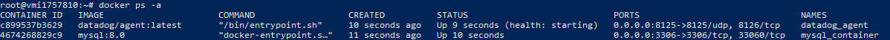
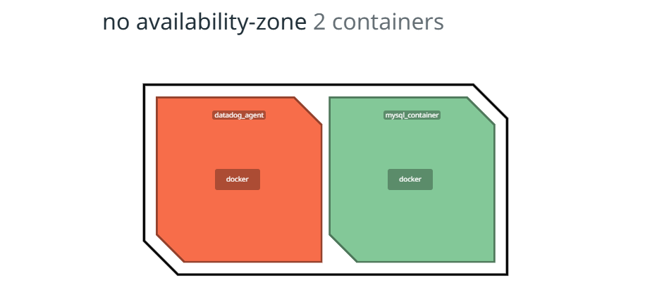

# Datadog Integration with Docker Compose

This documentation describes the process for integrating Datadog with a Docker environment, including setting up MySQL and Datadog Agent services using Docker Compose.

## Step 1: Sign Up for Datadog

1. Go to the [Datadog Sign Up page](https://www.datadoghq.com/).
2. Complete the sign-up process by entering your details.
3. Once signed up, log in to your Datadog account.
4. Datadog site will provide you with the api key
## Step 2: Connect to the Server via SSH

To connect to the server where you want to set up Datadog and Docker:

1. Open your terminal.
2. Use the following command to connect to the server:

    ```sh
    ssh root@your-server-ip
    ```

   Replace `your-server-ip` with the IP address of the server.

## Step 3: Create the Docker Compose File

Once you're connected to the server, create a Docker Compose file for the MySQL and Datadog Agent services. You can do this by creating a `docker-compose.yml` file.

1. Open a text editor (for example, `nano`):

    ```sh
    nano docker-compose.yml
    ```

2. Add the following content to the `docker-compose.yml` file:

    ```yaml
    version: '3'
    services:
      # MySQL service
      mysql:
        image: mysql:8.0
        container_name: mysql_container
        environment:
          MYSQL_ROOT_PASSWORD: rootpassword
          MYSQL_DATABASE: mydatabase
          MYSQL_USER: myuser
          MYSQL_PASSWORD: mypassword
        ports:
          - "3306:3306"
        volumes:
          - mysql_data:/var/lib/mysql

      # Datadog Agent service
      datadog-agent:
        image: "datadog/agent:latest"
        container_name: datadog_agent
        environment:
          - DD_API_KEY=your_datadog_api_key_here
          - DD_SITE=datadoghq.com
        volumes:
          - /var/run/docker.sock:/var/run/docker.sock
          - /proc/:/host/proc/:ro
          - /sys/fs/cgroup/:/host/sys/fs/cgroup/:ro
        ports:
          - "8125:8125/udp" # For DogStatsD metrics (optional)
        depends_on:
          - mysql

    volumes:
      mysql_data:
    ```

3. Replace `your_datadog_api_key_here` with the API key you obtained from Datadog.

4. Replace `datadoghq.com` with the Website that has your account.

5. Save the file and exit the editor (in `nano`, press `CTRL + X`, then press `Y` to confirm, and `Enter` to save).

## Step 4: Start the Services with Docker Compose

After creating the `docker-compose.yml` file, run the following command to start the services:

`docker-compose up -d`

After that you run 

`docker ps -a `

to see if the images are up and running it should give you a output like that 



## Step 5: Check DataDog WebSite

1. sign in to the used datadog account through the website 

2. navigate to infrastructure 

3. navigate to containers 

4. you should see 2 containers 1-datadog agent 2-mysql container

