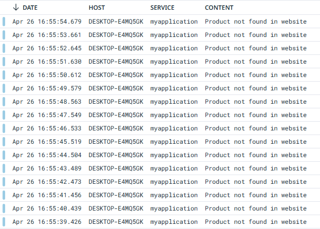

# Datadog Integration with Python Logs

This documentation describes the process for integrating Datadog with a Python application, including setting up log collection.

---

## Table of Contents
- [Requirements](#requirements)
- [Install Dependencies](#install-dependencies)
- [Python Script](#python-script)
- [Datadog Log Collection Configuration](#datadog-log-collection-configuration)
- [Restart Datadog Agent](#restart-datadog-agent)
- [Notes](#notes)

---

## Requirements

- Python 3.7+
- Packages:
  - `selenium`
  - `undetected-chromedriver`
  - `python-json-logger`
- (Optional) Datadog Agent installed and configured

---

## Install Dependencies

```bash
pip install selenium undetected-chromedriver python-json-logger
```

---

## Python Script

```python
if __name__ == '__main__':
    from selenium import webdriver
    from selenium.webdriver.common.by import By
    import undetected_chromedriver as uc
    import logging
    from pythonjsonlogger import jsonlogger 

    # Setup Chrome options
    options = uc.ChromeOptions()
    options.add_argument("--incognito")

    # Initialize Chrome Driver
    driver = uc.Chrome(executable_path="chromedriver.exe", options=options)
    driver.maximize_window()

    # Setup Logging
    logger = logging.getLogger()
    logHandler = logging.FileHandler(filename='C:/ProgramData/Datadog/log.json')
    formatter = jsonlogger.JsonFormatter()
    logHandler.setFormatter(formatter)
    logger.addHandler(logHandler)
    logger.setLevel(logging.INFO)

    try:
        driver.get("https://www.amazon.com/")
        driver.find_element(By.XPATH, value="//div[contains(@class,'product')]")
    except:
        logger.info('Product not found in website', extra={'referral_code': '79vn4et'})

    driver.quit()
```

---

## Datadog Log Collection Configuration

Enable logging in the Datadog Agent configuration (`datadog.yaml`):

```yaml
logs_enabled: true
```

Then, create or edit a custom log integration file (`conf.d`):

```yaml
logs:
  - type: file
    path: C:/ProgramData/Datadog/log.json
    service: myapplication
    source: python
    sourcecategory: sourcecode
```

---

## Restart Datadog Agent

After making configuration changes, restart the Datadog Agent:

```bash
datadog-agent restart
```

---

## Notes

- Ensure `chromedriver.exe` version matches your Chrome browser version.
- Make sure the directory `C:/ProgramData/Datadog/` is writable.
- Logs will be collected and visible in Datadog under the service name `myapplication`.


- Always keep `undetected-chromedriver` updated to prevent bot detection issues.

---
