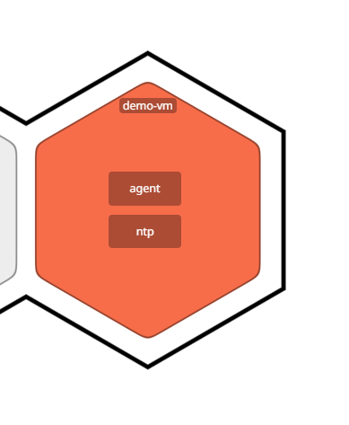

# 📘 Terraform Project Documentation: Datadog Monitored Azure VM

## 📁 Project Overview

This project provisions an Azure Virtual Machine and integrates it with Datadog for monitoring using **Terraform**. It also configures **Datadog alerts** for CPU usage.
## 📁 Terraform Code
```bash
terraform {
  backend "azurerm" {
    resource_group_name   = "tf-backend-rg"
    storage_account_name  = "terraform0tfstate022"
    container_name        = "tfstate"
    key                   = "terraform.tfstate"
  }

  required_providers {
    datadog = {
      source = "DataDog/datadog"
    }
  }
}

provider "azurerm" {
  features {}

  client_id       = var.client_id
  client_secret   = var.client_secret
  tenant_id       = var.tenant_id
  subscription_id = var.subscription_id
}

provider "datadog" {
  api_key = var.datadog_api_key
  app_key = var.datadog_app_key
  api_url = var.datadog_site
}


resource "azurerm_resource_group" "example" {
  name     = "dd-vm-rg"
  location = "East US"
}

resource "azurerm_virtual_network" "example" {
  name                = "dd-vnet"
  address_space       = ["10.0.0.0/16"]
  location            = azurerm_resource_group.example.location
  resource_group_name = azurerm_resource_group.example.name
}

resource "azurerm_subnet" "example" {
  name                 = "dd-subnet"
  resource_group_name  = azurerm_resource_group.example.name
  virtual_network_name = azurerm_virtual_network.example.name
  address_prefixes     = ["10.0.1.0/24"]
}
# Create a Network Security Group
resource "azurerm_network_security_group" "example" {
  name                = "dd-vm-nsg"
  location            = azurerm_resource_group.example.location
  resource_group_name = azurerm_resource_group.example.name

  # Inbound Security Rules
  security_rule {
    name                       = "Allow-RDP"
    priority                   = 1000
    direction                  = "Inbound"
    access                     = "Allow"
    protocol                  = "Tcp"
    source_port_range         = "*"
    destination_port_range    = "3389"  # For RDP (if you are using Windows)
    source_address_prefix     = "*"
    destination_address_prefix = "*"
  }

  security_rule {
    name                       = "Allow-SSH"
    priority                   = 1010
    direction                  = "Inbound"
    access                     = "Allow"
    protocol                  = "Tcp"
    source_port_range         = "*"
    destination_port_range    = "22"    # For SSH (if you are using Linux)
    source_address_prefix     = "*"
    destination_address_prefix = "*"
  }

  # Outbound Security Rules (Allow all outbound traffic for internet access)
  security_rule {
    name                       = "Allow-All-Outbound"
    priority                   = 2000
    direction                  = "Outbound"
    access                     = "Allow"
    protocol                  = "*"
    source_port_range         = "*"
    destination_port_range    = "*"
    source_address_prefix     = "*"
    destination_address_prefix = "*"
  }
}

# Attach NSG to Network Interface
resource "azurerm_network_interface_security_group_association" "example" {
  network_interface_id      = azurerm_network_interface.example.id
  network_security_group_id = azurerm_network_security_group.example.id
}

resource "azurerm_public_ip" "example" {
  name                         = "dd-vm-pip"
  location                     = azurerm_resource_group.example.location
  resource_group_name          = azurerm_resource_group.example.name
  allocation_method            = "Static"
  sku                          = "Basic"
}

resource "azurerm_network_interface" "example" {
  name                = "dd-nic"
  location            = azurerm_resource_group.example.location
  resource_group_name = azurerm_resource_group.example.name

  ip_configuration {
    name                          = "internal"
    subnet_id                     = azurerm_subnet.example.id
    private_ip_address_allocation = "Dynamic"
    public_ip_address_id          = azurerm_public_ip.example.id
  }
}


resource "azurerm_linux_virtual_machine" "example" {
  name                  = "demo-vm"
  location              = azurerm_resource_group.example.location
  resource_group_name   = azurerm_resource_group.example.name
  network_interface_ids = [azurerm_network_interface.example.id]
  size                  = "Standard_B1s"

  admin_username        = "testadmin"
  admin_password        = "Password1234!"  # Consider using a secret manager or var

  disable_password_authentication = false

  os_disk {
    name                 = "myosdisk1"
    caching              = "ReadWrite"
    storage_account_type = "Standard_LRS"
  }

  source_image_reference {
    publisher = "Canonical"
    offer     = "0001-com-ubuntu-server-jammy"
    sku       = "22_04-lts"
    version   = "latest"
  }

  tags = {
    role = "monitored-vm"
  }

custom_data = base64encode(<<-EOF
  #cloud-config
  packages:
    - curl
    - gnupg

  runcmd:
    - DD_API_KEY=${var.datadog_api_key} DD_SITE=us5.datadoghq.com bash -c "$(curl -L https://s3.amazonaws.com/dd-agent/scripts/install_script.sh)"
    - systemctl start datadog-agent
EOF
)

}


resource "datadog_monitor" "cpu_usage_alert" {
  name    = "High CPU Usage Alert"
  type    = "metric alert"
  message = "CPU usage is above 10% on {{host.name}} 🚨"

  query = <<-EOF
    avg(last_5m):100 - avg:system.cpu.idle{host:demo-vm} > 10
  EOF

  monitor_thresholds {
    critical          = 10
    critical_recovery = 9
  }

  notify_no_data    = false
  renotify_interval = 10
}

```

## ☁️ Infrastructure Provisioned

### 🔧 Resources

| Resource Type                 | Name             | Description                                 |
|-------------------------------|------------------|---------------------------------------------|
| Resource Group                | `dd-vm-rg`       | Main container for all Azure resources      |
| Virtual Network               | `dd-vnet`        | VNet for internal networking                |
| Subnet                        | `dd-subnet`      | Subnet within VNet                          |
| Network Security Group (NSG)  | `dd-vm-nsg`      | Controls inbound/outbound traffic           |
| Public IP                     | `dd-vm-pip`      | Static IP assigned to the VM                |
| Network Interface             | `dd-nic`         | Interface connecting VM to network          |
| Linux Virtual Machine         | `demo-vm`        | Ubuntu VM monitored by Datadog              |
| Datadog Monitor               | `cpu_usage_alert`| Alerts when CPU usage exceeds 10% threshold |


### 🧠 Datadog Monitor: High CPU Usage

**Query Used**:
```hcl
avg(last_5m):100 - avg:system.cpu.idle{host:demo-vm} > 10
```

**Thresholds**:
- Critical: > 10%
- Recovery: < 9%

### 📸 Screenshot: Datadog Monitor - Alert State


### 📸 Screenshot: Datadog Monitor - OK State


## 🗺️ Infrastructure Diagram




## 🔐 Secrets Management

For simplicity, secrets (like Datadog API key and Azure credentials) are passed as Terraform variables:
- `var.client_id`
- `var.client_secret`
- `var.subscription_id`
- `var.tenant_id`
- `var.datadog_api_key`
- `var.datadog_app_key`
- `var.datadog_site`


## ✅ Usage Instructions

```bash
terraform init
terraform plan -var-file="terraform.tfvars"
terraform apply -var-file="terraform.tfvars"
```

## 📦 Backend Configuration

Terraform state is stored remotely in Azure Blob Storage:

- Resource Group: `tf-backend-rg`
- Storage Account: `terraform0tfstate022`
- Container: `tfstate`
- Key: `terraform.tfstate`


## 🧼 Cleanup

To destroy the infrastructure:

```bash
terraform destroy
```


