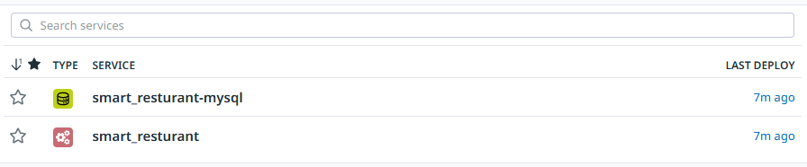
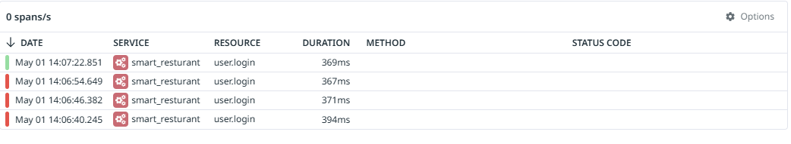
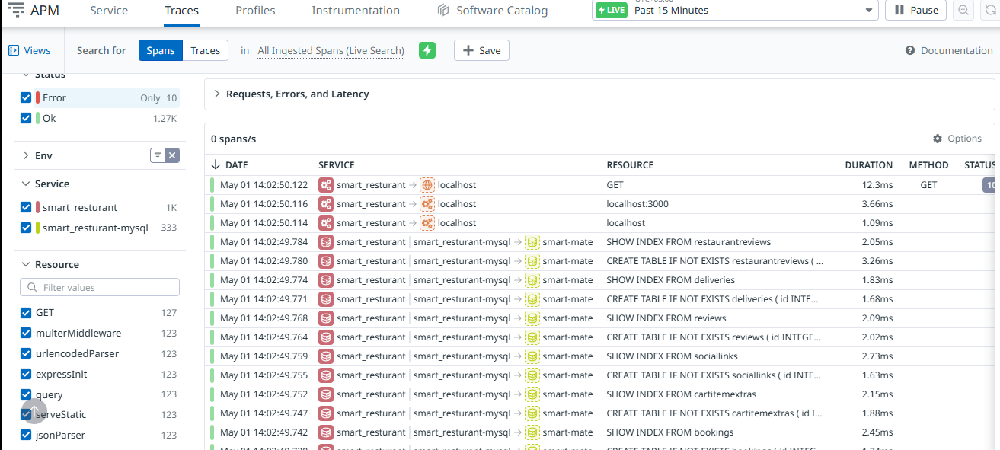

# Datadog Tracer Integration for Smart_Restaurant (Node.js)

This document explains how to instrument the **Smart_Restaurant** Node.js application with **Datadog APM (dd-trace)** for monitoring and observability.

---

## 📦 Installation

Install the `dd-trace` package:

```bash
npm install dd-trace
```

---

## 🚀 Initialization

Add the following snippet at the **very top of your main entry file** (`index.js`, `app.js`, etc.):

```js
const tracer = require('dd-trace').init({
  service: 'Smart_Resturant',  // Service name shown in Datadog APM
  env: 'Development',          // Environment: Development, Staging, Production, etc.
  version: '1.0.0',            // App version for tracking deployments
  logInjection: true           // Injects trace info into logs (if you're using a logger)
});

// Optional: Override or specify integrations manually
require('dd-trace').init({
  integrations: {
    express: true, // Enable Express instrumentation
    mysql: true,   // Enable MySQL instrumentation
    http: true     // Enable native HTTP module instrumentation
  }
});
```

> ⚠️ **Important**: This must be the very first `require()` in your app before any framework/library like Express or Sequelize is loaded.


---

## 🔍 Custom Tracing Example

You can trace a specific function manually like this:

```js
tracer.trace('user.login', { resource: 'LoginHandler' }, async (span) => {
  try {
    span.setTag('custom.tag', 'some-value');

    // your function logic
  } catch (err) {
    span.setTag('error', true);
    span.setTag('error.message', err.message);
    throw err;
  } finally {
    span.finish();
  }
});
```

---

## 📊 Viewing Traces in Datadog

1. Open the Datadog UI and go to **APM > Services**.
2. Search for the service name: `Smart_Resturant`.
3. Click on a service to view:
   - Traced requests
   - Custom spans (like `user.login`)
   - Tags and metadata
   - Error details (if any)


---

## ✅ Troubleshooting

- Make sure the **Datadog Agent** is running and APM is enabled:
  ```
  DD_APM_ENABLED=true
  ```
- it is enabled by default
- Confirm your app is sending data to the correct Datadog site (e.g., `datadoghq.com`, `datadoghq.eu`).

---
