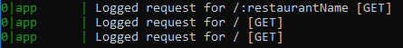
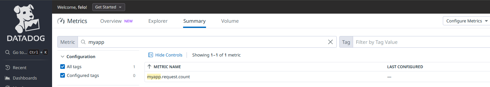

# Datadog Integration with Docker Compose

This documentation describes the process for integrating Datadog with a Docker environment, including setting up MySQL and Datadog Agent services using Docker Compose.

## Step 1: Sign Up for Datadog

1. Go to the [Datadog Sign Up page](https://www.datadoghq.com/).
2. Complete the sign-up process by entering your details.
3. Once signed up, log in to your Datadog account.
4. Datadog site will provide you with the api key

## Step 2: Connect to the Server via SSH

To connect to the server where you want to set up Datadog and Docker:

1. Open your terminal.
2. Use the following command to connect to the server:

    ```sh
    ssh root@your-server-ip
    ```

   Replace `your-server-ip` with the IP address of the server.

## Step 3: Install the Datadog Agent

1. **Install the Datadog Agent:**

   Run the following command to install the Datadog Agent, replacing `XXXXXXXXXXXXXXXXXXXXXXXXXXXXXXXX` with your **Datadog API key** and `account website` with your Datadog site region (e.g., `datadoghq.com` for US, `datadoghq.eu` for Europe):

   ```bash
   DD_API_KEY=XXXXXXXXXXXXXXXXXXXXXXXXXXXXXXXX \
   DD_SITE="account website" \
   bash -c "$(curl -L https://install.datadoghq.com/scripts/install_script_agent7.sh)"


    sudo nano /etc/datadog-agent/datadog.yaml
    use_dogstatsd: true
    dogstatsd_non_local_traffic: true
    sudo systemctl restart datadog-agent

## Step 4: Nodejs using dogstatd
1. Add the following content to the `app.js` file:

    ```yaml
    const StatsD = require('hot-shots');
    const dogstatsd = new StatsD();
    app.use((req, res, next) => {
        res.on('finish', () => {
            const route = req.route?.path || req.path || 'unknown';
            dogstatsd.increment('myapp.request.count', 1, [
            `route:${route}`,
            `method:${req.method}`,
            `status_code:${res.statusCode}`
            ]);
            console.log(`Logged request for ${route} [${req.method}]`);
        });
        next();
    });
    ```
2. install hotshots library using `npm install hot-shots`  

3. check from logs that function run using `pm2 logs`



## Step 5: Check DataDog WebSite

1. sign in to the used datadog account through the website 

2. navigate to metrics 

3. navigate to metrics summary 

4. you should see the created custom metric when you search by its name

